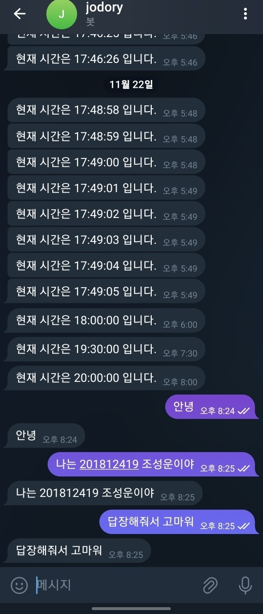

# 2023_2_opensw_201812419_HW2

본 프로젝트는 경기대학교 오픈소스SW 강의의 HW3로 telegram bot을 활용한 Echo 서버를 구현합니다. 

아래의 단계별 지침을 따라 진행해 주세요.


[참고한 사이트](https://jeong-f.tistory.com/149)


## 필요 패키지 설치
1. **패키지 설치**  
  

    1. telegram
  
   ```
   pip install -r requirements.txt
   ```


## 텔레그램 봇 Echo 실행 결과
   
   
